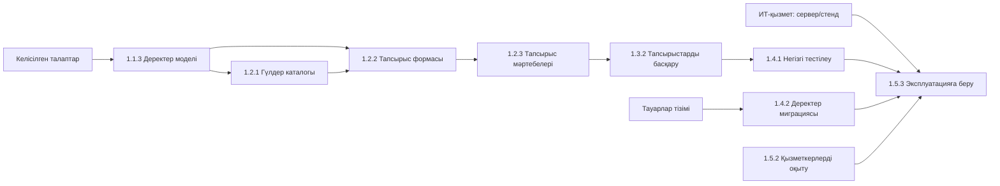

```mermaid
graph LR
  A[Келісілген талаптар] --> B[1.1.3 Деректер моделі]
  B --> C[1.2.1 Гүлдер каталогы]
  B --> D[1.2.2 Тапсырыс формасы]
  C --> D
  D --> E[1.2.3 Тапсырыс мәртебелері]
  E --> F[1.3.2 Тапсырыстарды басқару]
  G[ИТ-қызмет: сервер/стенд] --> H[1.5.3 Эксплуатацияға беру]
  F --> I[1.4.1 Негізгі тестілеу]
  J[Тауарлар тізімі] --> K[1.4.2 Деректер миграциясы]
  I --> H
  K --> H
  L[1.5.2 Қызметкерлерді оқыту] --> H
```
